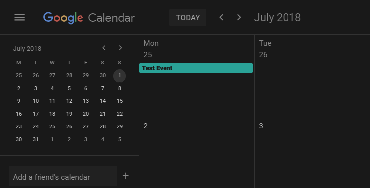

# Dark Google Calendar (2018)

Dark theme for Google Calendar that works with the new design. Hit me up with any hints if something could be improved.

This style is available to use [from Userstyles](https://userstyles.org/styles/143026/dark-google-calendar-2018) webpage.

## Preview

“**Really appreciate your awesome work. You are making my life so much better than Google's glaring light world.**” ~ pht049

## Installing

* If you're using a browser extension:
  * Stylus - get the addon for [Firefox](https://addons.mozilla.org/en-US/firefox/addon/styl-us/), [Chrome](https://chrome.google.com/webstore/detail/stylus/clngdbkpkpeebahjckkjfobafhncgmne) and [Opera](https://addons.opera.com/en-gb/extensions/details/stylus/).
  * Stylish - get the addon for [Firefox](https://addons.mozilla.org/en-US/firefox/addon/2108/), [Chrome](https://chrome.google.com/extensions/detail/fjnbnpbmkenffdnngjfgmeleoegfcffe), [Opera](https://addons.opera.com/en/extensions/details/stylish/), [Safari](http://sobolev.us/stylish/) and [Firefox Mobile](https://addons.mozilla.org/en-US/firefox/addon/2108/).  
  * Then install this style using:
    * [userstyles.org](https://userstyles.org/styles/143026/dark-google-calendar-2018) (with customization options)